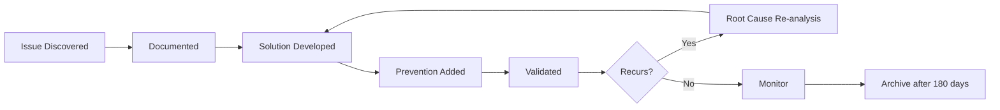

# Troubleshooting Knowledge Base
**Last Updated**: 2026-01-09
**Purpose**: Living repository of issues, solutions, and debugging strategies

---

## 🔧 Issue Template

```markdown
### [Issue ID]: [Short Description]
**Category**: [Build/Runtime/Performance/Deployment/etc.]
**Severity**: [Critical/High/Medium/Low]
**First Encountered**: YYYY-MM-DD
**Last Occurrence**: YYYY-MM-DD
**Frequency**: [Once/Rare/Occasional/Frequent]

**Symptoms**:
What observable behavior indicates this issue?

**Root Cause**:
What actually causes this problem?

**Solution**:
Step-by-step fix

**Prevention**:
How to avoid this in the future

**Related Issues**: Links to similar problems
**Pattern Impact**: Which patterns does this affect?
```

---

## 🚨 Critical Issues

### ISSUE-001: Memory Bank Out of Sync
**Category**: Configuration
**Severity**: Medium
**First Encountered**: 2026-01-09
**Frequency**: Occasional

**Symptoms**:
- Claude references outdated patterns
- Conflicting instructions in responses
- Memory sync command fails

**Root Cause**:
Memory bank files not committed to git, or merge conflicts in .claude/ directory

**Solution**:
```bash
# 1. Check git status of memory bank
git status .claude/memory-bank/

# 2. If conflicts exist, resolve manually
git diff .claude/memory-bank/

# 3. Run forced sync
claude "/sync-memory --force"

# 4. Verify integrity
claude "/memory-report"

# 5. Commit changes
git add .claude/memory-bank/
git commit -m "Resolve memory bank sync conflicts"
```

**Prevention**:
- Always commit memory bank changes
- Use pre-push hooks to verify sync
- Enable auto-commit for memory updates
- Review `/memory-report` weekly

**Related Issues**: ISSUE-005 (Git Merge Conflicts)
**Pattern Impact**: All patterns - affects entire learning system

---

### ISSUE-002: Token Budget Exceeded
**Category**: Performance
**Severity**: High
**First Encountered**: 2026-01-09
**Frequency**: Rare

**Symptoms**:
- Slower response times
- "Context too large" errors
- Degraded instruction following
- Memory overflow warnings

**Root Cause**:
Instruction count exceeded 175-200 threshold without cleanup

**Solution**:
```bash
# 1. Check current token usage
claude "/memory-report --token-analysis"

# 2. Run aggressive cleanup
claude "/cleanup-context --aggressive"

# 3. Archive old patterns
claude "/archive-old --older-than 90"

# 4. Review and consolidate
# Manually review .claude/memory-bank/ for duplicates

# 5. Verify improvement
claude "/memory-report"
```

**Prevention**:
- Set up automated weekly cleanup
- Monitor token usage in CLAUDE-metrics.md
- Use path-scoped rules instead of global
- Archive patterns older than 90 days automatically
- Enable token budget warnings at 150 instructions

**Related Issues**: ISSUE-007 (Context Window Optimization)
**Pattern Impact**: Affects all patterns - reduces learning capacity

---

## ⚠️ Common Issues

### ISSUE-003: Pattern Not Applied Correctly
**Category**: Learning
**Severity**: Medium
**Frequency**: Occasional

**Symptoms**:
Claude doesn't follow documented pattern, or applies it incorrectly

**Root Cause**:
- Pattern documentation too vague
- Conflicting patterns exist
- Pattern not in active scope
- Path-scoped rule not loading

**Solution**:
1. Review pattern documentation for clarity
2. Check for conflicting patterns: `claude "/memory-report --conflicts"`
3. Verify pattern is in correct scope (project vs. user)
4. Test pattern in isolation
5. Add more specific examples to pattern

**Prevention**:
- Use pattern template strictly
- Include clear examples with each pattern
- Run conflict detection monthly
- Test patterns after documentation

**Related Issues**: ISSUE-009 (Pattern Conflicts)

---

### ISSUE-004: Hot-Reload Not Working
**Category**: Skills
**Severity**: Low
**Frequency**: Rare

**Symptoms**:
Skill modifications in `.claude/skills/` not taking effect immediately

**Root Cause**:
- Hot-reload only works in Claude Code v2.1.0+
- Syntax error in skill definition
- Skill file not saved properly

**Solution**:
```bash
# 1. Check Claude Code version
claude --version

# 2. Validate skill syntax
cat .claude/skills/[skill-name].md

# 3. Force reload
# Make a trivial edit and save again

# 4. Restart Claude if needed (pre-v2.1.0)
```

**Prevention**:
- Upgrade to Claude Code v2.1.0+
- Validate skill syntax before saving
- Use linting for .md skill files

---

## 🔍 Debugging Strategies

### When Claude Doesn't Learn
**Checklist**:
- [ ] Verified `#` shortcut is enabled
- [ ] Checked memory bank file permissions
- [ ] Confirmed git tracking of .claude/ directory
- [ ] Ran `/sync-memory` after session
- [ ] Reviewed `/memory-report` for new entries
- [ ] No merge conflicts in memory files

### When Patterns Conflict
**Resolution Priority**:
1. Most recent pattern (unless legacy-critical)
2. Most specific pattern (over general)
3. Project-scope (over user-scope)
4. Explicitly marked precedence

### When Performance Degrades
**Investigation Steps**:
1. Check token usage: `/memory-report --tokens`
2. Review pattern count: `wc -l .claude/memory-bank/*.md`
3. Identify duplicate content: `grep -r "similar text" .claude/`
4. Run cleanup: `/cleanup-context`
5. Profile session: Review CLAUDE-metrics.md

---

## 📊 Issue Statistics

### Issues by Frequency
| Frequency | Count | Percentage |
|-----------|-------|------------|
| Critical (Daily) | 0 | 0% |
| Frequent (Weekly) | 0 | 0% |
| Occasional (Monthly) | 2 | 50% |
| Rare (Quarterly+) | 2 | 50% |

### Issues by Category
| Category | Count |
|----------|-------|
| Configuration | 1 |
| Performance | 1 |
| Learning | 1 |
| Skills | 1 |

---

## 🔄 Issue Lifecycle



---

## 💡 Learning from Issues

**Auto-Pattern Generation**:
When an issue is resolved, automatically consider:
- Should this solution become a pattern?
- Does this reveal a gap in documentation?
- Should we create a skill to detect this?
- Is a lifecycle hook needed to prevent this?

**Example**:
ISSUE-002 (Token Budget) → Created pattern "Token Budget Monitoring" → Added skill "context-pruning.md" → Lifecycle hook for auto-cleanup

---

## 🔗 External Resources

- [Claude Code Troubleshooting Guide](https://docs.anthropic.com/troubleshooting)
- [Community Issues Database](https://github.com/anthropics/claude-code/issues)
- Project-specific debugging runbook: `docs/debugging/`

---

**Auto-Update Instructions**:
- Use `/learn-from-error` command immediately after solving an issue
- System automatically creates issue entry with solution
- Link issues to affected patterns in CLAUDE-patterns.md
- Monthly review consolidates similar issues
