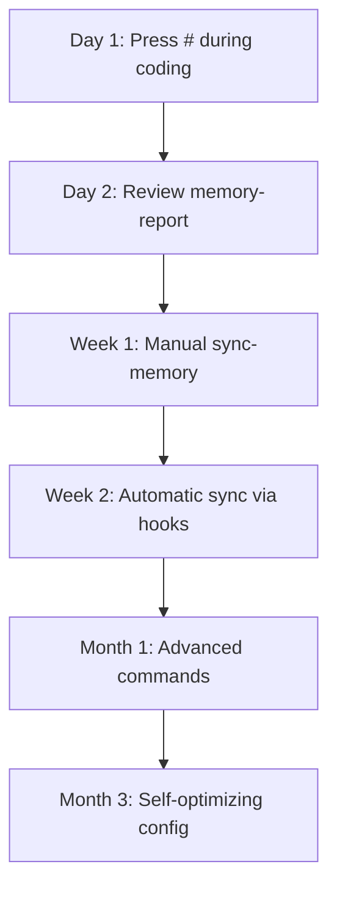
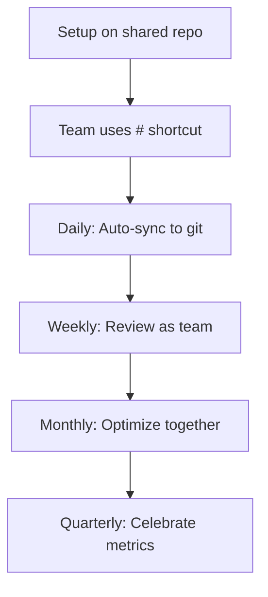

# 🚀 Quick Start Guide
**Get up and running in 5 minutes**

---

## ⚡ Super Quick Start (30 seconds)

```bash
# 1. Clone or copy this configuration
cp -r claude-self-learning-config/.claude /your-project/

# 2. Start using it immediately
cd /your-project
# Press '#' during coding to capture patterns!
```

That's it! The configuration is active.

---

## 📖 The 5-Minute Tutorial

### Step 1: Understanding the `#` Shortcut (30 seconds)

The **`#` key** is your learning trigger. Press it during any Claude session:

```
You: # Always use TypeScript strict mode
Claude: ✅ Instruction saved to CLAUDE.md

You: # API routes must include error handling
Claude: ✅ Instruction saved to CLAUDE.md
```

These instructions persist across sessions and are inherited by your whole team.

---

### Step 2: Automatic Learning (1 minute)

After completing a task successfully:

```bash
# Memory bank automatically syncs (via post-task hook)
# OR manually trigger:
claude "/sync-memory"
```

**What happens:**
1. Analyzes your recent code changes
2. Extracts reusable patterns
3. Documents architectural decisions
4. Logs solutions to problems
5. Updates `.claude/memory-bank/` files

---

### Step 3: View What Was Learned (30 seconds)

```bash
claude "/memory-report"
```

**Output:**
```yaml
📊 Memory Bank Status:
   Patterns: 8 documented
   Decisions: 3 recorded
   Issues solved: 5
   
📈 Top Patterns:
   1. Error Handling - 95% success rate
   2. API Structure - 100% success rate
   
💡 Token Budget: 87/200 (Healthy ✅)
```

---

### Step 4: Keep It Healthy (1 minute)

Weekly maintenance:

```bash
# Monday morning routine
claude "/memory-report"       # See what was learned
claude "/cleanup-context"     # Optimize if needed

# Commit and share with team
git add .claude/memory-bank/
git commit -m "Memory bank update: added 3 new patterns"
git push
```

---

### Step 5: Advanced Usage (2 minutes)

#### Learn from Errors
```bash
# After fixing a tricky bug
claude "/learn-from-error"
```

Claude will:
- Document the symptoms
- Record the solution
- Add prevention strategy
- Update troubleshooting guide

#### Document Decisions
```bash
# After making architectural choice
claude "/document-decision"
```

Claude prompts:
```
Decision: [Your choice]
Alternatives: [What you considered]
Rationale: [Why this is better]
```

Result: Creates ADR in `CLAUDE-decisions.md`

#### Extract Patterns
```bash
# After implementing something reusable
claude "/extract-pattern"
```

Claude:
- Identifies the reusable structure
- Generalizes it
- Documents with examples
- Adds to pattern library

---

## 🎯 Real-World Example

### Scenario: Building an API

**Day 1: Setup**
```bash
# You create your first endpoint
app.post('/users', async (req, res) => {
  // validation, error handling, etc.
});

# Press # to capture pattern
# "API endpoints follow: validation → business logic → response"
```

**Day 2: Expansion**
```bash
# Second endpoint follows same pattern
app.post('/posts', async (req, res) => {
  // Same structure!
});

# After task completes
claude "/sync-memory"
# ✅ Pattern "API Endpoint Structure" extracted automatically
```

**Day 3: Reuse**
```bash
You: "Create a new endpoint for comments"

Claude: "I'll follow the established API Endpoint Structure pattern:
1. Input validation
2. Business logic
3. Error handling
4. Response formatting"

# Claude applies the learned pattern automatically! 🎉
```

**Day 7: Maintenance**
```bash
claude "/memory-report"
# Output: API Endpoint pattern used 12 times, 100% success rate

claude "/cleanup-context"
# Optimizes memory bank, archives unused patterns
```

**Month 3: Team Growth**
```bash
# New developer joins team
git clone repo
cd repo

# They immediately inherit ALL learnings:
# - 47 documented patterns
# - 18 architectural decisions
# - 23 troubleshooting solutions
# - Zero onboarding friction! 🚀
```

---

## 🎓 Learning Paths

### For Individual Developers



**Timeline:**
- **Week 1**: Learn `#` shortcut and `/sync-memory`
- **Week 2**: Enable automatic sync hooks
- **Month 1**: Use advanced commands (`/learn-from-error`, `/extract-pattern`)
- **Month 3**: Configuration self-optimizes, 50+ patterns documented

---

### For Teams



**Team Workflow:**
- **Daily**: Each dev captures patterns with `#`
- **Daily**: Auto-sync commits memory updates
- **Weekly**: Team reviews `/memory-report` in standup
- **Monthly**: Joint `/cleanup-context` session
- **Quarterly**: Celebrate accuracy improvements

---

## 🏆 Success Indicators

### Week 1
- [ ] Used `#` shortcut 5+ times
- [ ] Ran `/sync-memory` after tasks
- [ ] 3+ patterns documented
- [ ] Team members using configuration

### Month 1
- [ ] 20+ patterns in library
- [ ] 5+ architectural decisions logged
- [ ] 10+ troubleshooting entries
- [ ] Automatic sync working
- [ ] Zero repeated questions

### Month 3
- [ ] 50+ patterns documented
- [ ] 90%+ pattern success rate
- [ ] Token budget optimized
- [ ] Measurable accuracy improvement
- [ ] New team members productive day 1

---

## 🛠️ Troubleshooting Quick Fixes

### "I pressed # but nothing happened"
```bash
# Check Claude Code version
claude --version  # Need v2.1.0+

# Or manually add to CLAUDE.md
echo "# [Your instruction]" >> .claude/CLAUDE.md
```

### "Memory not syncing"
```bash
# Check git status
git status .claude/

# Force sync
claude "/sync-memory --force"

# Verify
claude "/memory-report"
```

### "Too many instructions"
```bash
# Check token usage
claude "/memory-report --tokens"

# Run cleanup
claude "/cleanup-context"

# Should see: Token Budget: [lower]/200 ✅
```

---

## 📚 Next Steps

1. **Read the Full README** → `README.md`
2. **Explore Memory Bank** → `.claude/memory-bank/`
3. **Customize Hooks** → `.claude/hooks/`
4. **Join Community** → [Link to discussions]

---

## 💡 Pro Tips

### Tip 1: Capture While Fresh
```
✅ DO: Press # immediately when discovering pattern
❌ DON'T: Wait until end of day (you'll forget details)
```

### Tip 2: Be Specific
```
✅ DO: # API endpoints must validate input with Zod schemas
❌ DON'T: # Use validation
```

### Tip 3: Include Rationale
```
✅ DO: # [PATTERN] Use Redis for caching [REASON] 10x faster queries
❌ DON'T: # Use Redis
```

### Tip 4: Review Weekly
```
Monday morning routine:
1. claude "/memory-report"
2. Review new patterns
3. Run cleanup if needed
4. Commit changes
5. Team standup discussion
```

### Tip 5: Share Learnings
```
# After major feature completion
git add .claude/memory-bank/
git commit -m "Added authentication patterns"
git push

# Team benefits immediately!
```

---

## 🎯 Your First Session Checklist

- [ ] Configuration files in `.claude/` directory
- [ ] Read this Quick Start Guide
- [ ] Pressed `#` at least once
- [ ] Ran `/sync-memory`
- [ ] Viewed `/memory-report`
- [ ] Committed `.claude/` to git
- [ ] Shared with team (if applicable)

**Congratulations! You're now using a self-learning Claude configuration.** 🎉

Every pattern you discover, every decision you make, every problem you solve—all automatically captured and reused. Your configuration gets smarter with every project.

**Welcome to living documentation.** 📖✨

---

**Questions?** Check the full README.md or open an issue.

**Happy Learning!** 🚀
