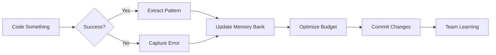

# Self-Learning Claude Configuration System

> **Transform your static Claude configuration into a living memory bank that evolves with every project.**

[]()
[]()
[]()

---

## 🎯 What Is This?

This is a **self-learning and self-updating Claude configuration system** that captures patterns, architectural decisions, and troubleshooting solutions automatically as you code. Think of it as a **Master Craftsman's Journal** that grows smarter with every project.

### The Problem It Solves

❌ **Traditional Approach**:
- Static `.claude/` files that become outdated
- Repeated explanations of the same patterns
- Lost knowledge when team members switch
- No memory of what worked before

✅ **Self-Learning Approach**:
- Configuration evolves automatically with your codebase
- Patterns captured in real-time with `#` shortcut
- Living memory bank syncs after every successful task
- Learns from both successes and failures

---

## ✨ Key Features

### 1. 🔄 Native Interactive Learning
Press `#` during any session to capture patterns instantly:
```markdown
# [CONTEXT] When creating API endpoints
# [ACTION] Always include rate limiting middleware
# [REASON] Because we had production incidents without it
```

### 2. 🧠 Modular Memory Bank
```
.claude/memory-bank/
├── CLAUDE-patterns.md        # Reusable coding patterns
├── CLAUDE-decisions.md       # Architectural decision records (ADRs)
├── CLAUDE-troubleshooting.md # Known issues & solutions
├── CLAUDE-snippets.md        # Copy-paste ready code
└── CLAUDE-metrics.md         # Performance tracking
```

### 3. 🤖 Autonomous Agents

#### Memory Bank Synchronizer
Automatically analyzes completed tasks and updates memory bank:
- Extracts reusable patterns from code
- Documents architectural decisions
- Logs troubleshooting solutions
- Maintains token budget health

#### Self-Update Skill (Hot-Reload ✅)
Claude modifies its own configuration intelligently:
- Recognizes when patterns should be documented
- Updates memory bank files autonomously
- Resolves configuration conflicts
- Optimizes instruction budget

#### Context Pruning Skill
Manages token budget automatically:
- Archives unused patterns (90+ days)
- Consolidates similar entries
- Converts to path-scoped rules
- Compresses examples

### 4. 🎣 Lifecycle Hooks
Automated learning triggers:
- **Post-Task Hook**: Syncs memory after successful tasks
- **Stop Hook**: Scans for new TODOs
- **PostToolUse Hook**: Updates documentation after file edits

### 5. 📊 Meta-Optimization
Track and improve learning effectiveness:
- Pattern success rates
- Token budget utilization
- Learning velocity metrics
- Accuracy improvements (target: +10.87%)

---

## 🚀 Quick Start

### Installation

```bash
# Clone or create the configuration
git clone <this-repo> .claude

# Or use the setup script
curl -fsSL https://example.com/setup.sh | bash

# Make hooks executable
chmod +x .claude/hooks/*.sh
```

### First Session

1. **Start coding** as usual
2. **Press `#`** when you discover something useful:
   ```
   # Always use Zod for API validation in this project
   ```
3. **Complete a task** successfully
4. **Automatic sync** happens via post-task hook
5. **Review changes** in `.claude/memory-bank/`

### Manual Sync

```bash
# After major changes
claude "/sync-memory"

# View what was learned
claude "/memory-report"

# Optimize token budget
claude "/cleanup-context"
```

---

## 📚 Core Concepts

### The "#" Shortcut - Your Learning Trigger

The fastest way to teach Claude:

```markdown
Syntax: # [instruction]

Examples:
# Use TypeScript strict mode for all new files
# API endpoints must include request logging
# Database migrations require rollback scripts
```

These instructions:
- ✅ Save immediately to appropriate scope
- ✅ Available in next session
- ✅ Inherited by entire team (if committed)

### The Memory Bank Lifecycle



### Token Budget Management

Claude has a **token budget limit** (~200 instructions):
- **0-149**: Healthy - keep learning
- **150-174**: Warning - optimize soon
- **175-199**: Critical - aggressive cleanup
- **200+**: Exceeded - block new additions

The **context-pruning skill** handles this automatically.

---

## 🎓 Usage Patterns

### Pattern 1: Capture While Coding

```typescript
// You discover a great error handling approach
export class AppError extends Error {
  constructor(public code: string, message: string) {
    super(message);
  }
}

// Press # immediately
# [PATTERN] Use custom AppError class for all errors
# [REASON] Consistent error handling across codebase
```

Result: Pattern documented in `CLAUDE-patterns.md` automatically

### Pattern 2: Learn from Errors

```bash
# You encounter an issue
$ npm run build
❌ Error: Cannot find module 'X'

# After fixing it
claude "/learn-from-error"
```

Result: Issue + solution added to `CLAUDE-troubleshooting.md`

### Pattern 3: Architectural Decisions

```bash
# After deciding to use PostgreSQL over MongoDB
claude "/document-decision"
```

Claude prompts:
```
Decision: Use PostgreSQL for primary database
Alternatives considered: MongoDB, MySQL
Rationale: [Claude helps you fill this out]
```

Result: ADR created in `CLAUDE-decisions.md`

### Pattern 4: Weekly Optimization

```bash
# Every Monday morning
claude "/memory-report"      # See what was learned
claude "/cleanup-context"    # Optimize token budget
git add .claude/memory-bank/
git commit -m "Weekly memory bank update"
git push
```

Result: Team gets all learnings from previous week

---

## 🔧 Configuration

### Sync Modes

```yaml
# .claude/config.yml

sync:
  automatic: true                # Auto-sync after tasks
  mode: "auto"                   # auto | manual | scheduled
  git_range: "HEAD~1..HEAD"      # Changes to analyze
  
thresholds:
  token_warning: 150
  token_critical: 175
  pattern_unused_days: 90
  issue_archive_days: 180
```

### Custom Slash Commands

Add your own commands in `.claude/commands/`:

```markdown
# .claude/commands/extract-pattern.md

Command: /extract-pattern
Description: Extract reusable pattern from current code
Actions:
  1. Analyze recent implementation
  2. Identify reusable structure
  3. Document in CLAUDE-patterns.md
  4. Add code examples
  5. Create cross-references
```

---

## 📊 Metrics & Analytics

### Learning Velocity

Track how fast your configuration improves:

```bash
claude "/memory-report --metrics"
```

Output:
```yaml
Learning Velocity:
  Patterns per week: 2.5
  Decisions per month: 4
  Issues resolved: 12
  
Accuracy Improvements:
  Baseline: 100% (2026-01-09)
  Current: 103.2%
  Target: +10.87%
  Progress: 29.5%
  
Token Budget:
  Current: 142/200 (71%)
  Status: Healthy ✅
  Last cleanup: 2026-01-09
```

### Pattern Performance

See which patterns work best:

```markdown
Top Performing Patterns:
1. Error Handling Pattern - 95% success, 47 uses
2. Repository Structure - 100% success, 12 uses
3. API Response Format - 92% success, 38 uses

Patterns Needing Improvement:
- None (all above 90% threshold)
```

---

## 🎯 Advanced Features

### Path-Scoped Rules

Load rules only for specific file types:

```bash
.claude/rules/backend/**/*.md    # Backend-specific
.claude/rules/frontend/**/*.md   # Frontend-specific
.claude/rules/tests/**/*.md      # Testing conventions
```

Example:
```markdown
# .claude/rules/api/**/validation.md

When working with API validation:
- Always use Zod schemas
- Export schema types
- Include error messages
- Test edge cases
```

### Hot-Reloading Skills

Modify skills during session (v2.1.0+):

```bash
# Edit skill while Claude is running
vim .claude/skills/self-update.md

# Changes apply immediately
# No restart needed!
```

### Meta-Optimization

Let Claude improve its own learning:

```bash
claude "/optimize-self"
```

Actions:
- Analyzes recent accuracy metrics
- Identifies pattern quality issues
- Suggests configuration improvements
- Updates learning algorithms

---

## 🔒 Best Practices

### Do's ✅

- **Commit memory bank regularly** - Share learnings with team
- **Use `#` shortcut frequently** - Capture patterns in real-time
- **Review weekly metrics** - Track improvement trends
- **Run cleanup monthly** - Keep token budget healthy
- **Archive rather than delete** - Preserve historical context

### Don'ts ❌

- **Don't ignore token warnings** - Degradation happens after 150 instructions
- **Don't skip backups** - Memory bank is critical infrastructure
- **Don't document everything** - Only reusable patterns (2+ uses)
- **Don't create vague patterns** - Include specific examples
- **Don't neglect conflicts** - Resolve contradictions immediately

---

## 🏆 Success Metrics

### Target Improvements (6 Months)

```yaml
Code Quality:
  Correctness: ≥95%
  Pattern adherence: ≥90%
  Bug reduction: -20%
  
Efficiency:
  Time to solution: -15%
  Repeated questions: -40%
  Context switching: -30%
  
Learning:
  Pattern library: 50+ patterns
  Decision records: 20+ ADRs
  Troubleshooting: 30+ solutions
  Overall accuracy: +10.87%
```

---

## 🛠️ Troubleshooting

### Memory Bank Out of Sync

```bash
# Check git status
git status .claude/memory-bank/

# Force resync
claude "/sync-memory --force"

# Verify integrity
claude "/memory-report"
```

### Token Budget Exceeded

```bash
# Check current usage
claude "/memory-report --tokens"

# Run aggressive cleanup
claude "/cleanup-context --aggressive"

# Archive old patterns
claude "/archive-old --older-than 60"
```

### Patterns Not Applied

```bash
# Check for conflicts
claude "/memory-report --conflicts"

# Verify pattern scope
cat .claude/memory-bank/CLAUDE-patterns.md

# Test pattern in isolation
claude "/test-pattern [pattern-name]"
```

---

## 📦 Directory Structure

Complete file tree:

```
.claude/
├── CLAUDE.md                          # Main configuration
├── memory-bank/
│   ├── CLAUDE-patterns.md             # Coding patterns
│   ├── CLAUDE-decisions.md            # Architecture decisions
│   ├── CLAUDE-troubleshooting.md      # Issue solutions
│   ├── CLAUDE-snippets.md             # Code snippets
│   └── CLAUDE-metrics.md              # Performance data
├── agents/
│   ├── memory-bank-synchronizer.md    # Auto-sync agent
│   ├── pattern-extractor.md           # Pattern recognition
│   └── context-optimizer.md           # Budget management
├── skills/
│   ├── self-update.md                 # Self-modification
│   ├── pattern-recognition.md         # Learning from code
│   └── context-pruning.md             # Budget optimization
├── rules/
│   ├── backend/                       # Backend-specific rules
│   ├── frontend/                      # Frontend-specific rules
│   └── tests/                         # Testing conventions
├── hooks/
│   ├── post-task.sh                   # After task completion
│   ├── memory-sync.sh                 # Automated sync
│   └── changelog-update.sh            # Doc updates
├── logs/
│   ├── sync-*.log                     # Sync operation logs
│   └── cleanup-*.log                  # Cleanup logs
├── backups/
│   └── YYYY-MM-DD_HHMMSS/             # Timestamped backups
└── audit-log/
    └── YYYY-MM-DD.log                 # Audit trail
```

---

## 🤝 Contributing

### Adding Patterns

1. Use `#` shortcut during session
2. Or manually add to `CLAUDE-patterns.md`
3. Follow pattern template
4. Include examples
5. Commit with descriptive message

### Improving Skills

1. Edit skill definition in `.claude/skills/`
2. Changes hot-reload immediately (v2.1.0+)
3. Test improvement
4. Document in skill changelog
5. Share with team

---

## 📖 Further Reading

- [Claude Code Documentation](https://docs.anthropic.com/claude/docs)
- [Advanced Prompt Engineering](https://docs.anthropic.com/claude/docs/advanced-prompting)
- [Architecture Decision Records](https://adr.github.io/)
- [LLM Evaluation Guide](https://arize.com/blog/llm-evaluation/)

---

## 📜 License

MIT License - Use freely, improve openly

---

## 🙏 Acknowledgments

Inspired by:
- The concept of "Living Documentation"
- Architecture Decision Records (ADRs)
- Continuous Learning Systems
- The Master Craftsman's Journal analogy

---

## 🎓 The Master Craftsman's Journal Analogy

> **Think of your self-learning config as a Master Craftsman's Journal.** 
>
> Every time the craftsman (Claude) discovers a better way to join wood or fixes a recurring mistake, they immediately jot it down in the margins of their handbook. Over time, the journal becomes more valuable than the tools themselves because it contains the distilled wisdom of every project ever completed in that specific workshop.

**Your configuration is that journal. Make it legendary.** 📖✨

---

**Questions? Issues? Improvements?**

Open an issue or submit a PR. This is a living system—it should evolve with the community.

**Happy Learning!** 🚀
